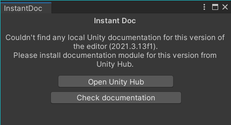
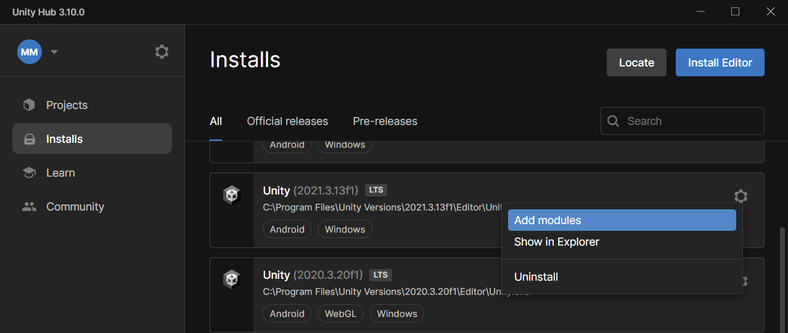
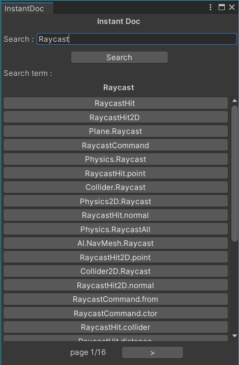

# Unity_InstantDoc

_This tool is a Unity editor tool._

Instant Doc is a Unity editor tool helping you acess the Unity documentation offline and directly in the editor.

## Usage

In the Unity Editor, in the top menu bar, under the "Tools" tab you'll find an "Instant Doc" option.\
This will open the Instant Doc editor window.

If the documentation is not found, the window will ask you to download it.

You can download the Unity documentation for your _current editor version_ through the **Unity Hub**.

Once the documentation is found, the tool will index it and be ready to be used.\
Enter a search term in the search bar and a list of results will be available.

Each search result is a Unity documenation page which will open in your internet browser.\
Links between pages work just like the online version.